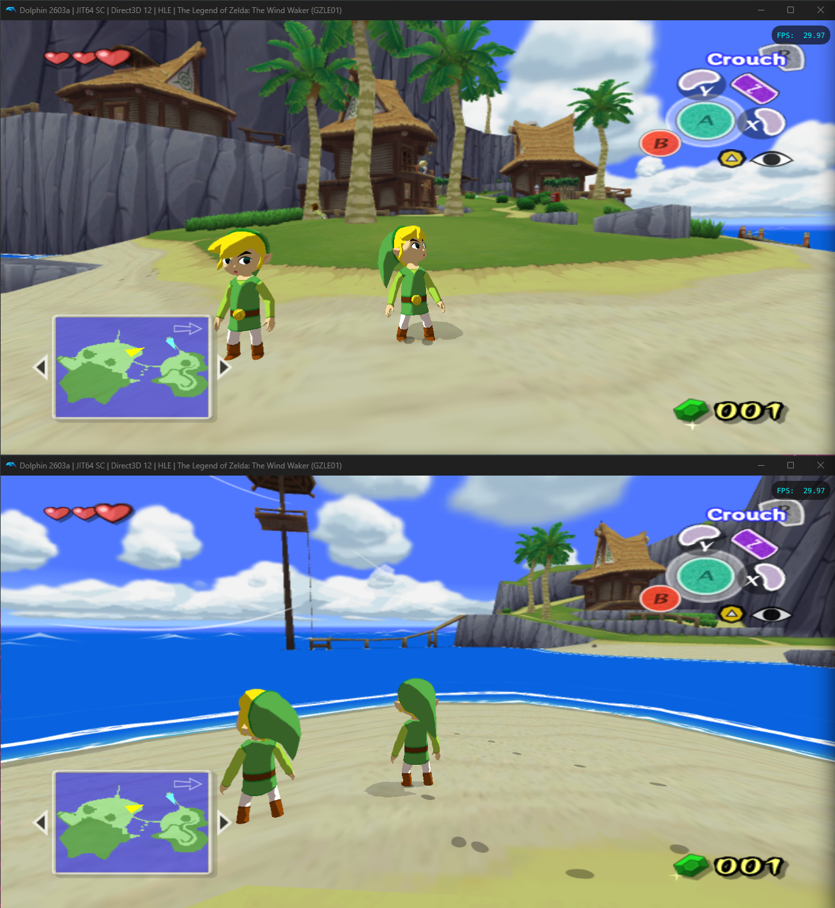

# Wind Waker Multiplayer




Real-time visual multiplayer for The Legend of Zelda: The Wind Waker on Dolphin.
Each player runs `ww-multiplayer` alongside their own Dolphin instance — positions and
skeletal poses are shared over TCP so each side sees the other's real Link
walking around in-game. Runs on **Windows and macOS** (Apple Silicon + Intel).

## Status

What works today:
- Reading your own Link's position + skeletal pose from a running Dolphin
- Hosting / joining a TCP session and exchanging positions + poses
- **Rendering each other's Link in-game** — your friend's Link walks around
  on Outset (or wherever you are) at their actual world coords, with their
  real animations, at ~50 ms latency on LAN

Known limits:
- Only Outset Island has been heavily tested. Stage / room transitions
  aren't gracefully handled yet (your friend's Link just renders at the
  last known coords if they cross to a different room).
- Local LAN tested. Internet play would work but firewall / NAT traversal
  isn't included.
- macOS first-run requires a one-time setup step: `scripts/setup-mac-dolphin.sh`
  copies `/Applications/Dolphin.app` to `~/Applications/Dolphin.app` and
  re-signs it without the hardened runtime, which lets AMFI permit
  `task_for_pid` against it. After that, no sudo is needed.

Active work is tracked in [GitHub issues](../../issues) — epics group related items, sub-issues are concrete tasks. `docs/06-history.md` is the session-by-session log of how the pipeline was built (precious for debugging).

## Quick start (end users)

### Windows

1. Download `ww-multiplayer.exe` from the [latest release](../../releases).
2. Patch your own legitimate copy of Wind Waker (NTSC-U, game ID `GZLE01`,
   `.iso` or `.ciso` works):
   ```
   ww-multiplayer.exe patch path\to\your-wind-waker.iso
   ```
   This produces `your-wind-waker-multiplayer.iso` next to the input. Your
   original is left untouched. Already-patched ISOs are detected and skipped.
3. Both players: boot the patched ISO in Dolphin and load a save (any save —
   saves don't have to match, and the other player's Link only appears once
   their session connects).
4. Host runs `ww-multiplayer.exe host` and shares the printed LAN IP.
5. Joiner runs `ww-multiplayer.exe join <host-ip>` (you can also pass a custom name:
   `ww-multiplayer.exe join 192.168.1.42 Alice`).
6. You should see each other's Link walking around in-game within a second
   or two. Ctrl+C in either terminal cleanly shuts down and hides Link #2.

### macOS

1. Download `ww-multiplayer-macos.tar.gz` from the [latest release](../../releases),
   untar it. You'll get a universal binary (`ww-multiplayer`) and a
   Finder-clickable wrapper (`WW Multiplayer.app`).
2. **Strip the Gatekeeper quarantine flag** — macOS adds it to anything
   downloaded from the internet, and the binary isn't signed by an Apple
   Developer cert. Without this step you'll get *"Apple could not verify
   'WW Multiplayer' is free of malware…"*:
   ```
   xattr -cr ww-multiplayer "WW Multiplayer.app"
   ```
3. **One-time Dolphin setup** — re-sign Dolphin without the hardened
   runtime so the binary can read its memory:
   ```
   ./scripts/setup-mac-dolphin.sh
   ```
   This copies `/Applications/Dolphin.app` to `~/Applications/Dolphin.app`
   and strips the hardened runtime flag from its main executable. Your
   original `/Applications/Dolphin.app` is left alone. Re-run this script
   any time you update Dolphin.
4. Patch your own legitimate copy of Wind Waker:
   ```
   ./ww-multiplayer patch ~/Roms/your-wind-waker.iso
   ```
5. Boot the patched ISO in your `~/Applications/Dolphin.app` copy and
   load a save.
6. Host: `./ww-multiplayer host` (or double-click `WW Multiplayer.app`).
7. Joiner: `./ww-multiplayer join <host-ip>`.

No sudo. The shipped binary is ad-hoc signed with the
`com.apple.security.cs.debugger` entitlement, and once Dolphin's
hardened runtime is off (step 2 above), AMFI lets the entitled binary
attach with `task_for_pid` from your normal user account.

For internet play the host just needs a reachable IP (port-forward :25565
or use a VPN / relay); the rest of the flow is identical.

We don't ship a pre-patched ISO for legal reasons (it would be a derivative
of the entire Wind Waker DOL). The patcher contains only our injected code
plus a list of byte-edit records; your vanilla DOL is the source of all
original game-code bytes.

## Requirements

- Windows 10+, or macOS 11+ (Apple Silicon or Intel)
- [Dolphin emulator](https://dolphin-emu.org/) — recent stable release
- Your own legitimate copy of The Wind Waker (NTSC-U, game ID `GZLE01`)
- [Go 1.21+](https://go.dev/dl/) — only if building from source. macOS
  builds also need the Xcode command-line tools (`xcode-select --install`)
  because the Mach VM bridge uses cgo.

## Building from source

```bash
git clone https://github.com/StephenSHorton/ww-multiplayer.git
cd ww-multiplayer
# Windows / Linux dev
go build -o ww-multiplayer.exe .
# macOS — universal binary + .app bundle
./scripts/build-mac.sh dev
# outputs dist/ww-multiplayer (universal) and dist/WW Multiplayer.app
```

The compiled C-side blob is checked in as `internal/inject/blob.go` so plain
Go builds work without the C toolchain. To rebuild the injected C code, see
`SETUP.md` (devkitPPC + Freighter), then run:

```bash
cd inject && python build.py        # rebuilds patched.dol
cd .. && python scripts/extract_blob.py  # regenerates blob.go
```

### Headless / debug commands

```bash
./ww-multiplayer.exe debug         # Print Link's position for 5 seconds (sanity check)
./ww-multiplayer.exe server        # Run a TCP server on :25565 with no UI
./ww-multiplayer.exe fake-client   # Connect a bot that walks in circles
./ww-multiplayer.exe help          # Full command list
```

## Contributing / hacking

- `docs/01-architecture.md` — how the pieces fit together
- `docs/06-history.md` — session-by-session log of what was built and why
- [GitHub issues](../../issues) — what's next, organized by epic
- `SETUP.md` — what you need to install if you want to work on the C
  injection side (devkitPPC, Freighter, wit, etc.)

## License

[MIT](LICENSE) — do whatever you want with it, no warranty, not liable.

This project does not include or distribute any Nintendo IP. The patcher
splices our own injected code into your own legitimately-acquired Wind
Waker disc image. You are responsible for the legality of your own ISO
in your jurisdiction.
